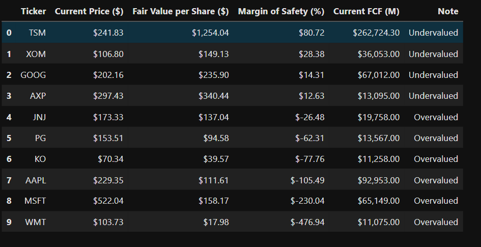
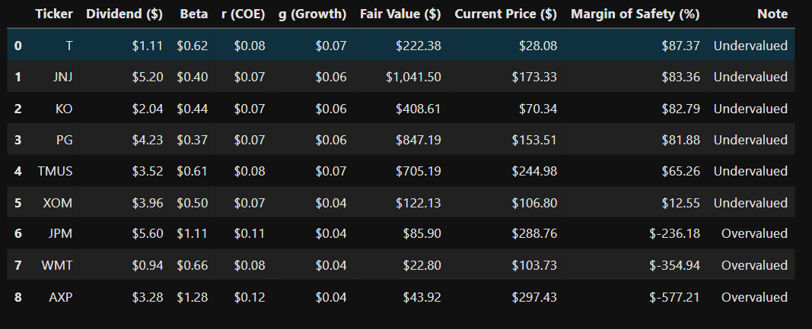
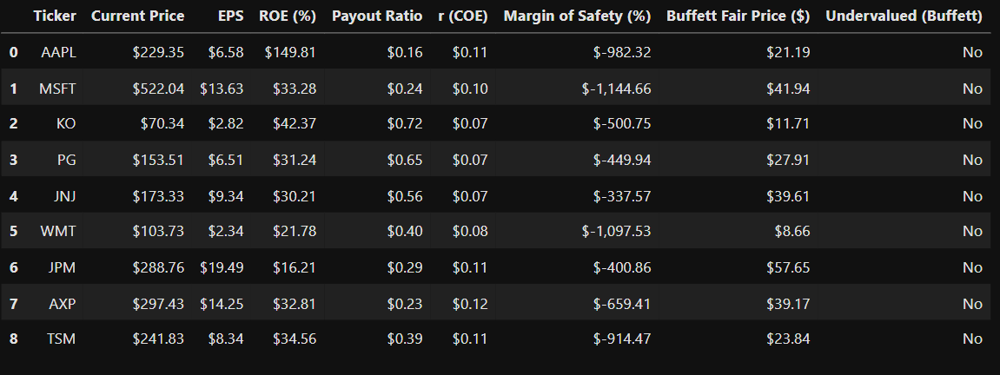
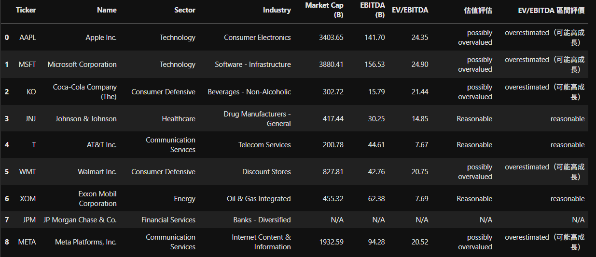
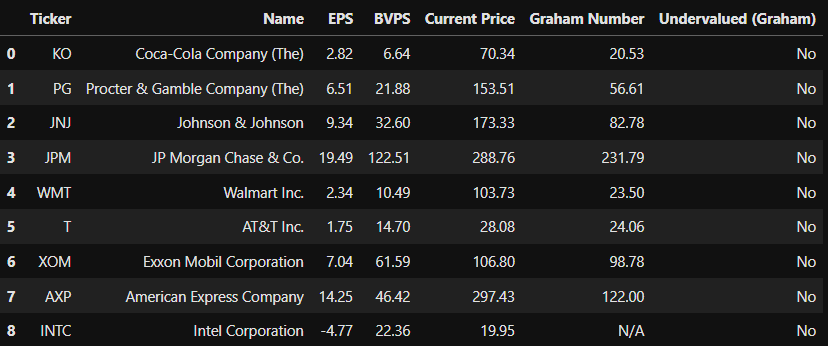
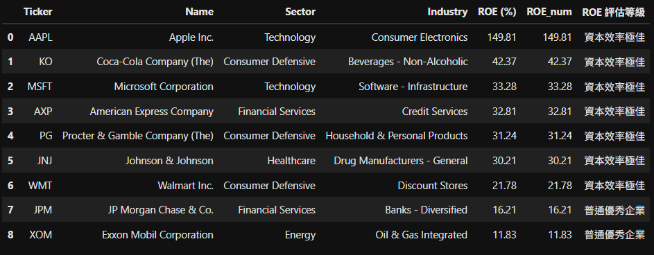
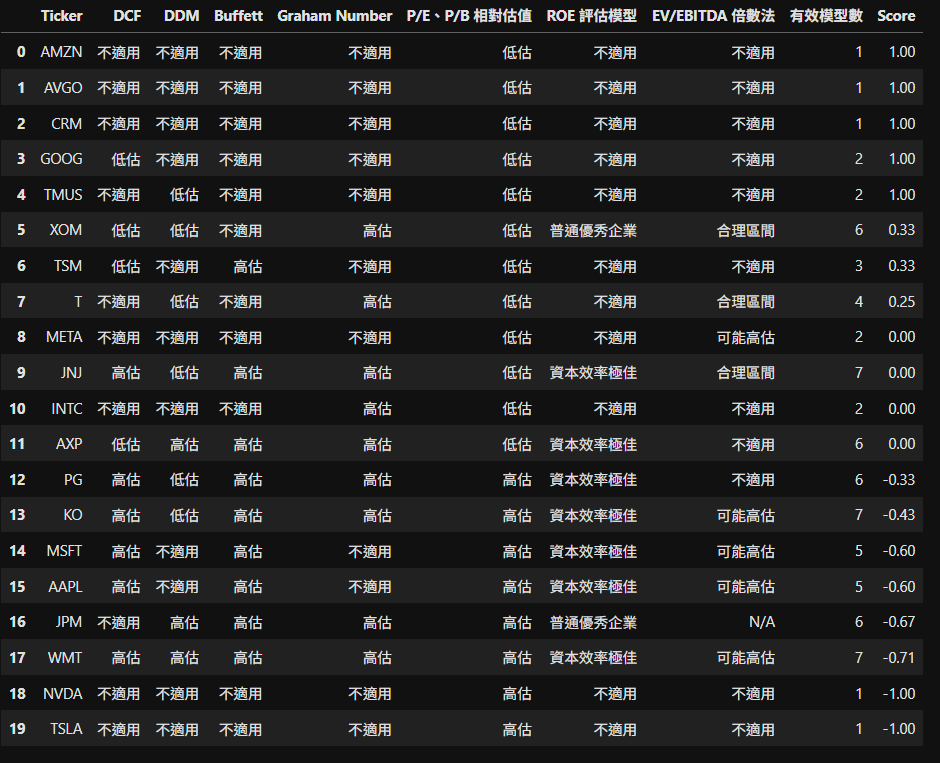

# 📈 Valuation Models 

---

## ✨ What this repo demonstrates

- **Seven valuation lenses** in one pass (see table below)
- **CSV‑first outputs** to `/output` + a **colour‑coded HTML** report (`report.html`)
- **Growth‑rate overrides** per ticker via `output/growth_rates.csv`
- **Consolidated view** (`combined_models.csv`) that merges all CSVs on `Ticker`
- **Resilient to missing data**: header‑only CSVs rather than crashes; robust merges
- **CI‑friendly**: single entry‑point notebook that you can wire to GitHub Actions

---

## Models at a glance (7 total)

| Model | Status | Data Source / Calculation | Formula |
|---|:--:|---|---|
| **DCF (Discounted Cash Flow)** | ✅ Implemented | Free cash flow from cashflow statement; discount & terminal growth from `config.json` | See formula below |
| **DDM (Dividend Discount Model)** | ✅ Implemented | Dividend history or `EPS × payout_ratio`; long‑run `g` from `config.json` or `growth_rates.csv` | Two‑stage Gordon |
| **Graham Number** | ✅ Implemented | EPS & BVPS from fundamentals | √(22.5 × EPS × BVPS) |
| **Buffett Fair Value (approx.)** | ✅ Implemented | EPS & growth (percent) from `growth_rates.csv` or info fallback | `EPS × (8.5 + 2g%)` |
| **Relative Valuation (P/E, P/B)** | ⚠️ Data pulled only | `trailingPE`, `priceToBook` (or `price / bookValue`) from `yfinance` | Direct multiples |
| **Residual Income (ROE snapshot)** | ⚠️ Data pulled only | ROE, BVPS, cost of equity ke = rf + β × MRP | AE = (ROE - ke) × BV *(snapshot)* |
| **EV/EBITDA Multiple** | ⚠️ Data pulled only | EV from market cap + debt − cash; EBITDA from info | EV / EBITDA |

> **Why "Data pulled only"?** For the last three, the notebook outputs the raw/derived ratios for comparison. A full multi‑period RI valuation is shown by formula but intentionally not expanded in this demo.

---

## 📁 Outputs (for screenshots)

```
output/
├─ pe_pb.csv               # P/E & P/B snapshot
├─ residual_income.csv     # ROE, k_e, abnormal earnings snapshot
├─ ev_ebitda.csv           # EV/EBITDA multiple
├─ results.csv             # Core valuations: DCF / DDM / Graham / Buffett‑approx
├─ report.html             # Coloured table (Undervalued / Overvalued)
├─ combined_models.csv     # Final consolidation on Ticker
└─ growth_rates.csv        # (Optional) Suggested g per ticker (Buffett/DDM)
```

---

## 🔎 Column glossary (quick meanings)

- **Ticker** — instrument code (e.g., `AAPL`, `2330.TW`, `GLD`)  
- **price** — latest price (recent close or real‑time fallback)  
- **trailingPE** — PE = Price / EPS_TTM  
- **priceToBook** — P/B = Price / BVPS  
- **beta (β)** — market sensitivity (≈1 market‑like; >1 more volatile; <1 defensive)  
- **ke** — cost of equity via CAPM: ke = rf + β × MRP  
- **net_income** — latest annual net income (GAAP/IFRS)  
- **book_equity (BV)** — shareholders' equity = assets − liabilities  
- **roe** — Net Income / Book Equity  
- **abnormal_earnings (AE)** — (ROE - ke) × BV *(snapshot)*  
- **ev_to_ebitda** — EV / EBITDA, with EV = Market Cap + Debt - Cash

---

## 🧮 Formulae (reference)

### DCF (Discounted Cash Flow)
```
Firm Value = Σ[FCF₀(1+g)ᵗ / (1+r)ᵗ] + [FCFₙ(1+g) / (r-g)] × [1/(1+r)ᴺ]
where FCFₙ = FCF₀(1+g)ᴺ
```

### DDM (Dividend Discount Model - two‑stage, simplified)
```
P₀ ≈ Σ[D₀(1+g)ⁱ / (1+ke)ⁱ] + [D_{n+1} / (ke-g)] × [1/(1+ke)ⁿ]
```

### Graham Number
```
√(22.5 × EPS × BVPS)
```

### Residual Income (full valuation form)
```
Intrinsic Value = BV₀ + Σ[RIₜ / (1+ke)ᵗ]
where RIₜ = (ROEₜ - ke) × BV_{t-1}
```

### EV/EBITDA
```
EV / EBITDA
where EV = Market Cap + Debt - Cash
```

---

## 🖼️ Demo gallery

All screenshots are generated by the notebook and saved under `output/`.

### Core valuations




### Multiples & snapshot models





### Consolidated conclusion


---

## ⚙️ Minimal "how to run locally"

```bash
pip install -U yfinance pandas numpy
# Open Valuation_Demo.ipynb in Jupyter / VS Code and Run All
# Outputs will appear in ./output
```

Optional config (`config.json`):
```json
{
  "discount_rate": 0.09,
  "terminal_growth": 0.025,
  "ddm_defaults": {
    "payout_ratio": 0.35,
    "long_run_growth": 0.03
  }
}
```

Optional growth overrides (`output/growth_rates.csv`):
```
Ticker, recommended_g_buffett_percent, recommended_g_ddm_decimal
AAPL,   8.0,                           0.03
MSFT,   7.0,                           0.025
```

---

## 📎 Contact

**Kai Yeh**  
Email: KaiYeh820206@gmail.com  
GitHub: https://github.com/WayneKaiYeh

---

## 📄 License

This repository is shared under the **Creative Commons BY‑NC‑ND 4.0** licence.  
- ❌ No commercial use
- ❌ No derivatives or redistribution
- ✅ Attribution required

All rights to any private research notebooks and datasets are reserved.