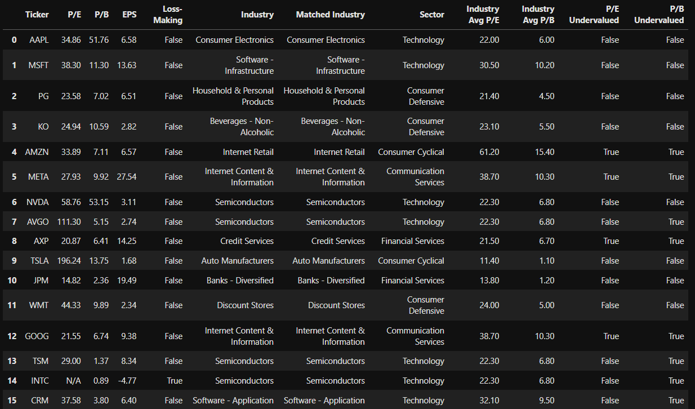

# 📈 Valuation Models 


---

## Models at a glance (7 total)

| Model | Status | Data Source / Calculation | Formula |
|---|:--:|---|---|
| **DCF (Discounted Cash Flow)** |  Implemented | Free cash flow from cashflow statement; discount & terminal growth from `config.json` | See formula below |
| **DDM (Dividend Discount Model)** |  Implemented | Dividend history or `EPS × payout_ratio`; long‑run `g` from `config.json` or `growth_rates.csv` | Two‑stage Gordon |
| **Graham Number** |  Implemented | EPS & BVPS from fundamentals | √(22.5 × EPS × BVPS) |
| **Buffett Fair Value (approx.)** |  Implemented | EPS & growth (percent) from `growth_rates.csv` or info fallback | `EPS × (8.5 + 2g%)` |
| **Relative Valuation (P/E, P/B)** |  Data pulled only | `trailingPE`, `priceToBook` (or `price / bookValue`) from `yfinance` | Direct multiples |
| **Residual Income (ROE snapshot)** |  Data pulled only | ROE, BVPS, cost of equity ke = rf + β × MRP | AE = (ROE - ke) × BV *(snapshot)* |
| **EV/EBITDA Multiple** |  Data pulled only | EV from market cap + debt − cash; EBITDA from info | EV / EBITDA |


---

##  Outputs 

```
output/
├─ pe_pb.csv               # P/E & P/B snapshot
├─ residual_income.csv     # ROE, k_e, abnormal earnings snapshot
├─ ev_ebitda.csv           # EV/EBITDA multiple
├─ results.csv             # Core valuations: DCF / DDM / Graham / Buffett‑approx
├─ report.html             # Coloured table (Undervalued / Overvalued)
├─ combined_models.csv     # Final consolidation on Ticker
└─ growth_rates.csv        # (Optional) Suggested g per ticker (Buffett/DDM)
```

---

## Column glossary (quick meanings)

- **Ticker** — instrument code (e.g., `AAPL`, `2330.TW`, `GLD`)  
- **price** — latest price (recent close or real‑time fallback)  
- **trailingPE** — PE = Price / EPS_TTM  
- **priceToBook** — P/B = Price / BVPS  
- **beta (β)** — market sensitivity (≈1 market‑like; >1 more volatile; <1 defensive)  
- **ke** — cost of equity via CAPM: ke = rf + β × MRP  
- **net_income** — latest annual net income (GAAP/IFRS)  
- **book_equity (BV)** — shareholders' equity = assets − liabilities  
- **roe** — Net Income / Book Equity  
- **abnormal_earnings (AE)** — (ROE - ke) × BV *(snapshot)*  
- **ev_to_ebitda** — EV / EBITDA, with EV = Market Cap + Debt - Cash

---

## Formulae (reference)

### DCF (Discounted Cash Flow)
```
Firm Value = Σ[FCF₀(1+g)ᵗ / (1+r)ᵗ] + [FCFₙ(1+g) / (r-g)] × [1/(1+r)ᴺ]
where FCFₙ = FCF₀(1+g)ᴺ
```


### DDM (Dividend Discount Model - two‑stage, simplified)
```
P₀ ≈ Σ[D₀(1+g)ⁱ / (1+ke)ⁱ] + [D_{n+1} / (ke-g)] × [1/(1+ke)ⁿ]
```


### Graham Number
```
√(22.5 × EPS × BVPS)
```


### Residual Income (full valuation form)
```
Intrinsic Value = BV₀ + Σ[RIₜ / (1+ke)ᵗ]
where RIₜ = (ROEₜ - ke) × BV_{t-1}
```

### EV/EBITDA
```
EV / EBITDA
where EV = Market Cap + Debt - Cash
```


### Buffett fair price


### P/E & P/B relative



### ROE ranking & grading


### Consolidated conclusion


---


Optional config (`config.json`):
```json
{
  "discount_rate": 0.09,
  "terminal_growth": 0.025,
  "ddm_defaults": {
    "payout_ratio": 0.35,
    "long_run_growth": 0.03
  }
}
```
---

## 📎 Contact

**Kai Yeh**  
Email: KaiYeh820206@gmail.com  
GitHub: https://github.com/WayneKaiYeh

---

## 📄 License

This repository is shared under the **Creative Commons BY‑NC‑ND 4.0** licence.  
-  No commercial use
-  No derivatives or redistribution
-  Attribution required

All rights to any private research notebooks and datasets are reserved.